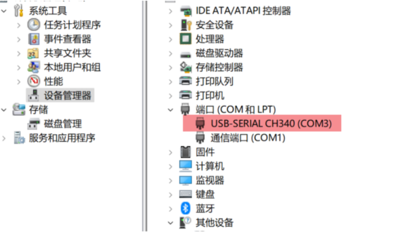

# SD2小电视
  
### **开源版本主要功能**  

SD2小电视AIO版本  
采用esp8266作为主控  
支持WEB配网，网络连接显示  
  

### **商业版本固件** 
 
SD2固件V2.0.3烧写地址0.bin  
SD2文件系统V2.0.3烧写地址0x200000.bin  
商业版本烧录固件后，即可使用基础功能。  
如需要使用高级功能需要激活码(复制出机器码后，问群主索要，每份2元)  
在星光微电子工作室的淘宝店购买的实物，默认出厂激活。没激活的可凭单号，免费索要激活码  
商业版本使用的天气服务，及高级功能都需要商用服务器。  
为维护该开源项目，请大家理解，支持。  
### **商业版本固件基础功能（无需激活码）** 
 
网络获取时间及天气  
支持全国1900+城市天气  
支持三日天气显示  
支持图片显示  
支持股票显示  
支持闹钟  
### **商业版本固件高级功能（需要激活码）** 
 
支持右下角动画修改，支持动画达1000+  
支持时钟样式修改，支持时钟样式4种  
支持电脑监控  

###  **开发工具**  

采用VSCODE软件开发，安装PlatformIO插件，PlatformIO Core 6.1.13 Home 3.4.4  
  1. CH340驱动安装  
1.1 驱动下载安装  
https://www.wch.cn/downloads/category/67.html?feature=USB%E8%BD%AC%E4%B8%B2%E5%8F%A3&product_name=CH340  
根据自己的平台下载对应的版本然后安装。  
1.2 检验安装是否成功  
使用usb的数据线连接小电视或者开发板，如果 资源管理器面板可以看到新增了串口，说明安装成功  
  
2. 开发环境搭建  
安装Visual Studio Code  
安装插件 PlatformIO  
Clone 代码，然后打开即可  

###  **欢迎加入SD2AIO内测QQ讨论群** 

群号320203052  

